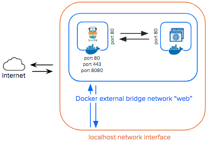

# Docker with Traefik Proxy Prototype

This is a mini protype running on Docker engine, using docker-compose to launch a Traefik proxy (reverse proxy) and a tiny web app Whoami.  
The Whoami web app is implemented in go and returns client os information and HTTP request details.

Images used:
- traefik/traefik:v2.8
- traefik/whoami:v1.8.1

To understand more about Traefik: https://youtu.be/AqiGcLsVMeI  
Traefik documentation: https://doc.traefik.io/traefik/

## Pre-requisite

- Docker installed (tested with Docker version 19.03.13, build 4484c46d9d)
- Internet access and credentials to connect to https://hub.docker.com/
## Environement Variables

Environment variables are managed with .env files located under folder ./env/  
In this project we use only one file: .env file

## Configuration Files

Configuration files are located under folder ./conf/  
In this project we use only one file: traefik.yaml

# Start & Complete Shutdown

## Launch Procedure

_Make sure Docker deamon is running_  
`$ docker version`

_Create the network with the arbitrary name 'web' which will be used by Traefik and the managed services_  
`$ docker network create web`

_Create the containers and launch the services as defined within the docker-compose file_  
`$ docker-compose --env-file ./env/.env -f docker-compose.traefik.yaml up -d`

*Un lancement reussi permet l'acces aux services suivants:*

- Traefik dashboard http://localhost:8080/
- La page web de l'app Whoami http://whoami.localhost/

## Shudown Procedure

_Graceful shutdown of the services, removal of containers, and anything created by the the docker-compose file_  
`$ docker-compose --env-file ./env/.env -f docker-compose.traefik.yaml down`
